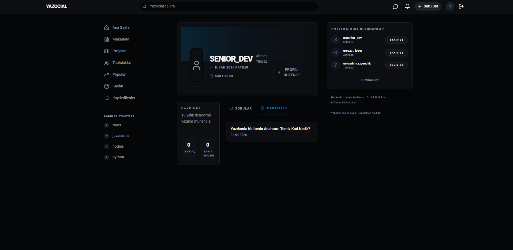

# Yazocial 🚀

[🇹🇷 Türkçe Çeviri İçin Tıklayın (Click for Turkish Translation)](#türkçe)

<br/>

## English

**Yazocial** is a modern, full-stack social network and Q&A platform designed exclusively for developers. It combines the community aspects of social media with the technical problem-solving structure of platforms like StackOverflow.

### 🌟 Key Features
* **Communities & Forums:** Create and join tech-specific communities, share posts, and discuss trends.
* **Q&A System:** Ask technical questions, get answers, upvote the best solutions, and mark accepted answers.
* **Real-Time Communication:** Live chat, direct messaging, and real-time notifications powered by Socket.io.
* **Gamification:** Earn reputation points and unlock badges based on your platform activity and contributions.
* **Modern UI/UX:** A fully responsive, dark-mode-first aesthetic built with Tailwind CSS.
* **Advanced Auth:** Secure JWT-based authentication with role management (User, Moderator, Admin).

### 🛠 Technical Stack & Architecture

#### Frontend (`/client`)
* **Core:** React 19, Vite (for blazing fast builds)
* **Styling:** Tailwind CSS v4, Lucide React (for icons)
* **State Management:** Zustand (global state), TanStack React Query v5 (server state & caching)
* **Routing:** React Router DOM v7
* **Networking:** Axios, Socket.io-client

#### Backend (`/api`)
* **Core:** Node.js, Express.js
* **Database:** MongoDB & Mongoose ORM
* **Real-time:** Socket.io
* **Security & Auth:** bcryptjs, jsonwebtoken (JWT), express-rate-limit, CORS
* **Validation:** Joi
* **Logging:** Winston, Morgan

### 📸 Screenshots

<details>
<summary>Click to view Screenshots</summary>
<br>




</details>

### 🚀 Installation & Running Locally

1. **Clone the repository**
2. **Setup Backend:**
   ```bash
   cd api
   npm install
   # Create a .env file based on environment requirements (CONNECTION_STRING, JWT_SECRET etc.)
   npm start
   ```
3. **Setup Frontend:**
   ```bash
   cd client
   npm install
   # Create a .env file (VITE_API_URL vs.)
   npm run dev
   ```
4. **Seed Database (Optional):**
   ```bash
   cd api
   node seed.js
   ```

---

<br/>

## Türkçe

**Yazocial**, yazılımcılar için özel olarak tasarlanmış modern, tam kapsamlı (full-stack) bir sosyal medya ve soru-cevap platformudur. Sosyal medyanın topluluk dinamiklerini, StackOverflow gibi platformların teknik problem çözme yapısıyla birleştirir.

### 🌟 Temel Özellikler
* **Topluluklar ve Forumlar:** Teknolojiye özel topluluklar oluşturun/katılın, gönderiler paylaşın ve tartışın.
* **Soru-Cevap Sistemi:** Teknik sorular sorun, cevaplar alın, en iyi çözümleri oylayın (upvote/downvote) ve kabul edilen cevapları işaretleyin.
* **Gerçek Zamanlı İletişim:** Socket.io altyapısı ile anlık mesajlaşma, DM ve gerçek zamanlı bildirimler.
* **Oyunlaştırma (Gamification):** Platformdaki etkileşimlerinize göre itibar puanı (reputation) kazanın ve rozetler (badges) toplayın.
* **Modern Arayüz:** Tailwind CSS ile geliştirilmiş, tamamen duyarlı (responsive) ve karanlık mod öncelikli şık tasarım.
* **Gelişmiş Yetkilendirme:** JWT tabanlı güvenli kimlik doğrulama ve rol yönetimi (Kullanıcı, Moderatör, Admin).

### 🛠 Teknik Altyapı ve Mimari

#### Frontend (İstemci - `/client`)
* **Çekirdek:** React 19, Vite (hızlı derleme için)
* **Stil:** Tailwind CSS v4, Lucide React (ikonlar için)
* **Durum Yönetimi (State):** Zustand (global state), TanStack React Query v5 (sunucu state & önbellekleme)
* **Yönlendirme:** React Router DOM v7
* **Ağ & İletişim:** Axios, Socket.io-client

#### Backend (Sunucu - `/api`)
* **Çekirdek:** Node.js, Express.js
* **Veritabanı:** MongoDB & Mongoose ORM
* **Gerçek Zamanlı İşlemler:** Socket.io
* **Güvenlik & Auth:** bcryptjs, jsonwebtoken (JWT), express-rate-limit, CORS
* **Doğrulama (Validation):** Joi
* **Loglama:** Winston, Morgan

### 📸 Ekran Görüntüleri

<details>
<summary>Ekran Görüntülerini Görmek İçin Tıklayın</summary>
<br>


</details>

### 🚀 Kurulum ve Çalıştırma

1. **Projeyi klonlayın**
2. **Backend Kurulumu:**
   ```bash
   cd api
   npm install
   # Gerekli çevre değişkenlerini (CONNECTION_STRING, JWT_SECRET vb.) içeren bir .env dosyası oluşturun
   npm start
   ```
3. **Frontend Kurulumu:**
   ```bash
   cd client
   npm install
   # Gerekli çevre değişkenlerini içeren bir .env dosyası oluşturun
   npm run dev
   ```
4. **Veritabanı Örnek Veri Yükleme (İsteğe Bağlı):**
   ```bash
   cd api
   node seed.js
   ```